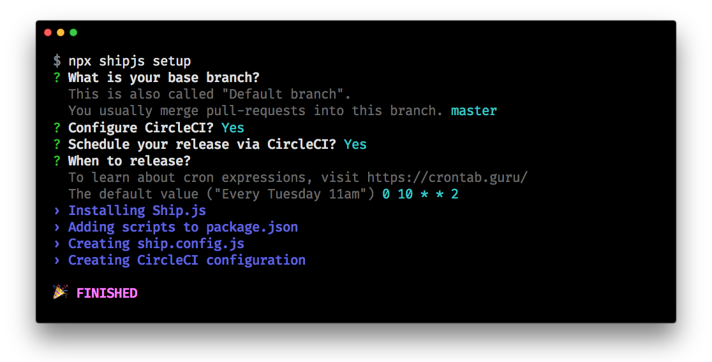

<h1 align="center">🛳 Ship.js</h1>

<p align="center">
  <a href="http://npmjs.com/package/shipjs"></a>
  <a href="https://circleci.com/gh/algolia/shipjs"></a>
  <a href="https://github.com/algolia/shipjs/blob/master/LICENSE"></a>
  <a href="https://github.com/algolia/shipjs#contributors-"></a>
  <a href="https://join.slack.com/t/shipjs/shared_invite/enQtODc3OTc3NjQ0NDg3LTU3ZDgyMzlkNzY2YTMxMGQ1MzE3OGMzZjMzYjU5Y2NmZDQ5Mzk1ZWUxZjk3NWFjMDIwYmI0ZGUyY2E2YTZkYzk"></a>
</p>

<p align="center">
  Take control of what is going to be your next release.<br>
  <a href="https://community.algolia.com/shipjs/">https://community.algolia.com/shipjs/</a>
</p>

## Features

- Automated
  - Minimize your effort for release and make less mistakes.
- Asynchronous
  - You don't have to release on your local machine. Do it asynchronously and continue your work.
- Collaborative
  - Don't sweat it alone. Review the next release on pull request with your colleagues.

## Installation

Running the following command will guide you to set it up interactively.

```bash
npx shipjs setup
```

This interactive CLI will help you install Ship.js into your package and create a tailored config file for your project.



## Why 🤷🏻‍

Coding is fun, debugging and testing are okay, but releasing is NOT.

When releasing, you go through something like the following:

- Update the version in `package.json`
- Update the changelog
- Actually release it (e.g. `npm run build && npm publish`)
- Create a git tag
- Create a release on GitHub

### What could go wrong?

- You might make mistakes during the release.
  - Environments are different across your team members.
  - You're releasing alone because the whole process happens on your local machine.
  - It's not your everyday-job. Mistakes can happen.
- You are blocked and cannot do anything else until it's done.
  - Even if you have a release script, you need to watch until the script finishes well.
  - You don't want to switch to another feature branch and work there until the script finishes.

## How to solve them❓

In Ship.js, the release process consists of three parts.

### Part 1. Preparation (`shipjs prepare`)


Run `shipjs prepare` and it will briefly do the following:

- Figure out next version.
- Update the version and changelog.
- Create a pull request.

It takes less than a couple of minutes.

### Part 2. Review

- Review the PR by yourself, or with your colleagues.
- Add more commits to the PR if you want.
- You can hold the release, build from the staging branch and test it manually.
- If you want to cancel the release, just close the PR and delete the staging branch.

When you think it's ready to release, merge the PR.

### Part 3. Trigger a release (`shipjs trigger`)

Run `shipjs trigger` and it will briefly do the following:

- Run a final test (unit, e2e, etc).
- Release it to NPM (or elsewhere as you configure it).
- Create a git tag for the version.
- Create a release for the tag on GitHub.

You can manually run `shipjs trigger` on the base branch after the PR is merged.

However you can also configure your CI service(e.g. CircleCI) to do this for you. It means the longest process is on the CI service asynchronously, not occupying your working environment.

## Getting Started

Let's move on to the [guide](https://community.algolia.com/shipjs/guide/getting-started.html).

Or, you can watch this video if you prefer.

[](https://www.youtube.com/watch?v=FPj7urChN_E)

## How is it different from semantic-release?

**semantic-release** is a tool for `fully automated version management and package publishing`.

Ship.js gives you more control over the release process. Ship.js automatically creates a PR before publishing every release, so that you can:

- Confirm the next version is correct.
- Confirm which commits are going to be released and discuss them with colleagues.
- Edit the automatically generated changelog for clarity & readability.
- Run any automated tests on the package release candidate.
- Build a release candidate automatically (with [Pika CI](https://github.com/marketplace/pika-ci-cd) or [CodeSandbox](https://github.com/apps/codesandbox)).

## How to Contribute?

[Read Contribution Guide →](https://community.algolia.com/shipjs/guide/contributing.html)

## Contributors ✨

Thanks goes to these wonderful people ([emoji key](https://allcontributors.org/docs/en/emoji-key)):

<!-- ALL-CONTRIBUTORS-LIST:START - Do not remove or modify this section -->
<!-- prettier-ignore-start -->
<!-- markdownlint-disable -->
<table>
  <tr>
    <td align="center"><a href="https://twitter.com/eunjae_lee"><br /><sub><b>Eunjae Lee</b></sub></a><br /><a href="https://github.com/algolia/shipjs/commits?author=eunjae-lee" title="Code">💻</a> <a href="https://github.com/algolia/shipjs/commits?author=eunjae-lee" title="Documentation">📖</a></td>
    <td align="center"><a href="http://www.fredkschott.com"><br /><sub><b>Fred K. Schott</b></sub></a><br /><a href="https://github.com/algolia/shipjs/commits?author=FredKSchott" title="Documentation">📖</a></td>
    <td align="center"><a href="https://uechi.io"><br /><sub><b>Yasuaki Uechi</b></sub></a><br /><a href="https://github.com/algolia/shipjs/commits?author=uetchy" title="Code">💻</a> <a href="https://github.com/algolia/shipjs/commits?author=uetchy" title="Documentation">📖</a></td>
    <td align="center"><a href="https://jeetiss.github.io/"><br /><sub><b>Dmitry Ivakhnenko</b></sub></a><br /><a href="https://github.com/algolia/shipjs/commits?author=jeetiss" title="Code">💻</a> <a href="https://github.com/algolia/shipjs/commits?author=jeetiss" title="Documentation">📖</a></td>
    <td align="center"><a href="https://ghuser.io/jamesgeorge007"><br /><sub><b>James George</b></sub></a><br /><a href="https://github.com/algolia/shipjs/commits?author=jamesgeorge007" title="Code">💻</a> <a href="https://github.com/algolia/shipjs/commits?author=jamesgeorge007" title="Documentation">📖</a></td>
    <td align="center"><a href="https://www.patreon.com/kazupon"><br /><sub><b>kazuya kawaguchi</b></sub></a><br /><a href="https://github.com/algolia/shipjs/commits?author=kazupon" title="Code">💻</a> <a href="#blog-kazupon" title="Blogposts">📝</a></td>
    <td align="center"><a href="https://tyankatsu.netlify.com/"><br /><sub><b>tyankatsu</b></sub></a><br /><a href="https://github.com/algolia/shipjs/commits?author=tyankatsu0105" title="Code">💻</a> <a href="https://github.com/algolia/shipjs/commits?author=tyankatsu0105" title="Documentation">📖</a></td>
  </tr>
  <tr>
    <td align="center"><a href="https://haroen.me"><br /><sub><b>Haroen Viaene</b></sub></a><br /><a href="https://github.com/algolia/shipjs/commits?author=Haroenv" title="Code">💻</a></td>
    <td align="center"><a href="https://github.com/heavenshell"><br /><sub><b>Shinya Ohyanagi</b></sub></a><br /><a href="https://github.com/algolia/shipjs/commits?author=heavenshell" title="Code">💻</a></td>
    <td align="center"><a href="https://donghoon-song.github.io"><br /><sub><b>Donghoon Song</b></sub></a><br /><a href="https://github.com/algolia/shipjs/commits?author=donghoon-song" title="Code">💻</a></td>
    <td align="center"><a href="https://github.com/miyajan"><br /><sub><b>Miyata Jumpei</b></sub></a><br /><a href="https://github.com/algolia/shipjs/commits?author=miyajan" title="Code">💻</a></td>
    <td align="center"><a href="https://riotz.works"><br /><sub><b>lulzneko</b></sub></a><br /><a href="https://github.com/algolia/shipjs/commits?author=lulzneko" title="Code">💻</a> <a href="https://github.com/algolia/shipjs/commits?author=lulzneko" title="Documentation">📖</a></td>
    <td align="center"><a href="https://vinayakkulkarni.dev"><br /><sub><b>Vinayak Kulkarni</b></sub></a><br /><a href="https://github.com/algolia/shipjs/commits?author=vinayakkulkarni" title="Code">💻</a></td>
  </tr>
</table>

<!-- markdownlint-enable -->
<!-- prettier-ignore-end -->
<!-- ALL-CONTRIBUTORS-LIST:END -->

This project follows the [all-contributors](https://github.com/all-contributors/all-contributors) specification. Contributions of any kind welcome!

## Badge [](https://github.com/algolia/shipjs)

Show the world you're using Ship.js

```md
[](https://github.com/algolia/shipjs)
```

```html
<a title="deploy" href="https://github.com/algolia/shipjs" rel="nofollow">
  
</a>
```
