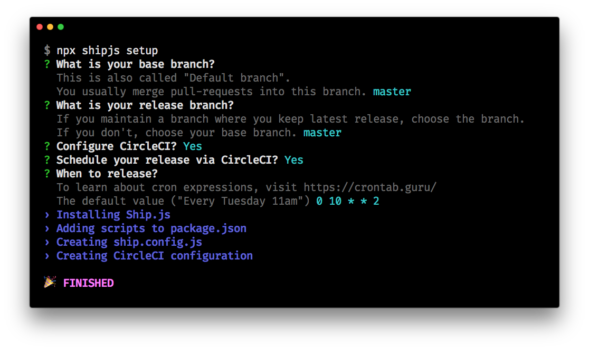

# Getting Started

You can following the guide below, or watch this video.

<iframe width="560" height="315" src="https://www.youtube.com/embed/FPj7urChN_E" frameborder="0" allow="autoplay; encrypted-media" allowfullscreen></iframe>

## Installation

Running the following command will guide you to set it up interactively.

```bash
npx shipjs setup
```

This interactive CLI will help you install Ship.js into your package and create a tailored config file for your project.



Otherwise, you can still do it manually.

```bash
npm install --save-dev shipjs

or

yarn add -D shipjs
```

Add the following to the `scripts` section in your `package.json`.

```js
"scripts: {
  //...
  "release": "shipjs prepare",
}
```

### GitHub Token

:::warning
If you use Ship.js at work, I recommend you to get a token from a shared account, not from your personal account because after you quit, your token will still be used.
:::

GitHub token is used in both `shipjs prepare` and `shipjs trigger`.

1. Go to [https://github.com/settings/tokens/new](https://github.com/settings/tokens/new)
2. Check "repo(Full control of private repositories)"
3. Generate/copy the token

You can put it in the following two ways:

- Prepend it in your command like: `GITHUB_TOKEN=xxx shipjs prepare`
- Create a file named ".env" and put the following content: `GITHUB_TOKEN=xxx` (".env" should not be committed. Add it to ".gitignore".)

If you automate flows in your CI, you can add the token to Environment Variable section in your CI service.

### Dry Mode

If you're not sure, you can always run commands in dry mode.

```bash
yarn run release --dry-run
# or
npm run release -- --dry-run
```

It will show you which steps are going to be executed without actually executing them.

## On your local machine

- Part 1: `yarn run release` will create a pull request.
- Part 2: Review and merge the PR.
- Part 3: `git pull` and `yarn shipjs trigger`(or `npx shipjs trigger`) to actually publish it to NPM.

## Automate Part 3 (`trigger`)

This guide is based on CircleCI. It may be done similarly on other CI services.

If you are using GitHub Actions, you can jump to [Setup GitHub Actions](./getting-started.html#setup-github-actions).

A minimal `.circleci/config.yml` looks like the following:

```yaml
version: 2
jobs:
  shipjs_trigger:
    docker:
      - image: 'circleci/node:latest'
    steps:
      - checkout
      - run:
          name: Install
          command: yarn install
      - run:
          name: Triggering Ship.js to Release
          command: yarn shipjs trigger
workflows:
  version: 2
  release_if_needed:
    jobs:
      - shipjs_trigger:
          filters:
            branches:
              only:
                - master # or whatever branch you'd like (normally your base branch)
```

At Part 2, if you merge the PR, a new commit will be added and CircleCI will run `yarn shipjs trigger`(or `npx shipjs trigger`). Then, it will check if the latest commit message is in convention and the current branch is right. If the conditions are met, it will trigger a release. Otherwise, it will skip.

When merging a PR, you need to "Squash and merge" into a single commit.

You can go to "Settings" menu of your repository, and even force "Squash and merge" behavior under "Merge button" section.

To learn more, you can read [this](https://help.github.com/en/github/collaborating-with-issues-and-pull-requests/about-pull-request-merges#squash-and-merge-your-pull-request-commits).

### NPM Token

Setup an NPM token to allow Ship.js(**at CircleCI**) to release the package to NPM.

1. Login at [https://www.npmjs.com/](https://www.npmjs.com/), click your profile icon and go to "Tokens".
2. Click "Create New Token", make sure the access level is "Read and Publish" and copy the token.
3. At CircleCI, go to "Project Settings" → "BUILD SETTINGS" → "Environment Variables".
4. Click "Add Variable".
   - Name: `NPM_AUTH_TOKEN`
   - Value: Paste the token from clipboard.

:::warning WARNING for 2FA
If you have enabled 2FA for both authorization and publishing, when `shipjs trigger` runs, it will be prompted for one-time password. You probably have configured CI service (CircleCI, GitHub Actions, etc) to run that command for you. It means `shipjs trigger` will be stuck.

NPM has [released](https://github.blog/changelog/2020-10-02-npm-automation-tokens/) a new feature "Automation token" to solve this.


:::

### GitHub Token

Setup a GitHub token to allow Ship.js(**at CircleCI**) to create a git tag and push it to remote after release.

1. Go to https://github.com/settings/tokens/new
2. Check "repo(Full control of private repositories)"
3. Generate/copy the token
4. At CircleCI, go to "Project Settings" → "BUILD SETTINGS" → "Environment Variables".
5. Click "Add Variable".
   - Name: `GITHUB_TOKEN`
   - Value: Paste the token from clipboard.

## Setup GitHub Actions

If you are using GitHub Actions, you need to setup the NPM token to release package to NPM:

1. Login at [https://www.npmjs.com/](https://www.npmjs.com/), click your profile icon and go to "Auth Tokens".
2. Click "Create New Token", make sure the access level is "Read and Publish" and copy the token.
3. At your GitHub repo, go to "Settings" → "Secrets".
4. Click "Add a new secret".
   - Name: `NPM_AUTH_TOKEN`
   - Value: Paste the token from clipboard.
